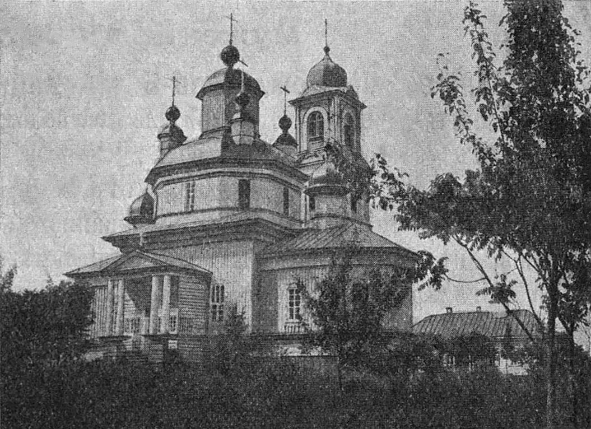
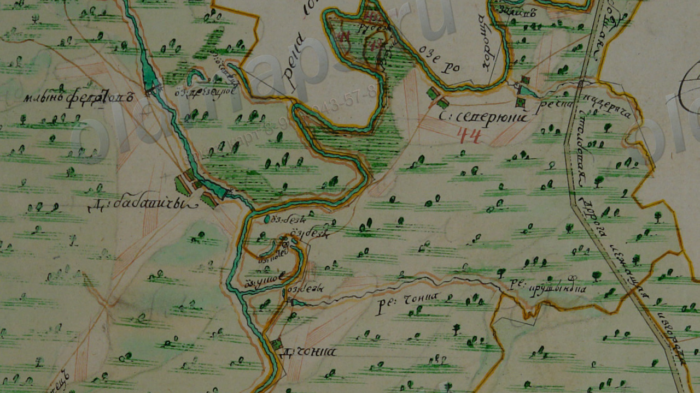
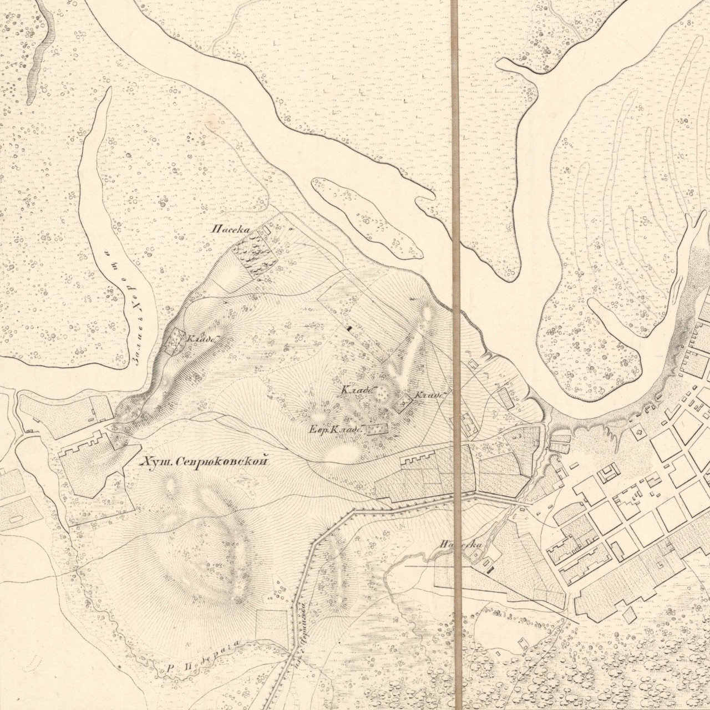
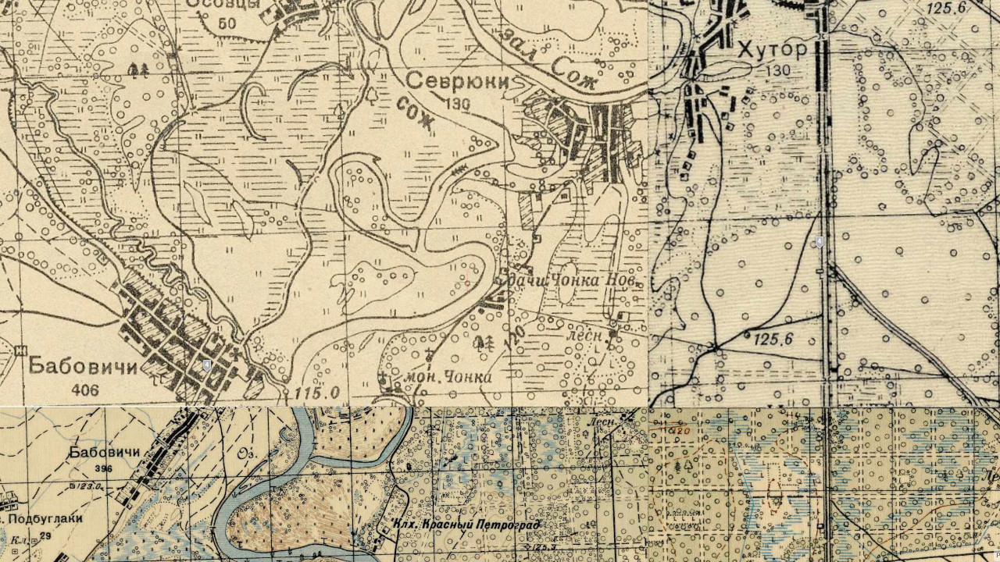

# Гісторыя

Першыя пасяленьні зьявіліся ў гэтых краях яшчэ ў старажытныя часы: за 1 км на
ўсход ад прафілякторыя «Гомсельмаш», у лесе каля дачнага пасёлка, знаходзіцца
гарадзішча пэрыяду раньняга жалезнага веку V ст. да н.э. -- V ст. н.э.

Зь вёсак найстарэйшымі зьяўляюцца Сеўрукі, Чонкі на 2 стагодзьдзі маладзейшыя.
Паляна наймаладзейшая.

## Сеўрукі

Паводле пісьмовых крыніц вядомыя з XVI стагодзьдзя як вёска ў Рэчыцкім павеце
Менскага ваяводзтва Вялікага княства Літоўскага. У 1560 годзе значыцца як хутар
у Гомельскім старостве. У інвэнтары Гомельскага староства 1640-х гадоў
пазначаныя як сяло ва ўладаньні гомельскага баярына Л. Шарынды.

Пасьля 1-га падзелу Рэчы Паспалітай (1772) у складзе Расейскай імпэрыі. У 1777
годзе ў Гомельскай воласьці Беліцкага павета, ва ўладаньні дваран Усьціновічаў
і Клічаўскіх. У 1785 годзе вёска Сеўрукі са 140 душамі мужчынскага полу
куплена казной у яе ўладальнікаў (пані Усьціновічавай і памешчыкаў Клічаўскіх)
для павелічэньня насельніцтва павятовага горада Новай Беліцы. Прыгонныя сяляне
Сеўрукоў станавіліся свабоднымі, запісваліся ў мяшчанскае саслоўе й
перасяляліся большай часткай у павятовы цэнтар.

Дзейнічала прыстань.

### Насельніцтва
- 1777 -- 125 «рэвіскіх душ»
- 1785 -- 140 «рэвіскіх душ»
- 1896 -- 95 двароў
- 1909 -- 121 двор, 627 жыхароў
- 1926 -- 183 двары, 901 жыхар
- 1959 -- 533 жыхара
- 2004 -- 200 гаспадарак, 509 жыхароў
- 2009 -- 529 жыхароў
- 2019 -- 532 жыхары

## Чонкі

Паводле пісьмовых крыніц вёска вядомая з XVII стагодзьдзя, калі тут пачалі
сяліцца ўцекачы з Масковіі праз рэлігійны перасьлед. Паводле [А.Ф.
Рогалева](books.html) ў 1760 годзе ў данай мясцовасьці ўзьнік стараверскі
Іасафаўскі скіт, які заснаваў Іасаф, выхадзец з Гжацка.

Пасьля першага падзелу Рэчы Паспалітай (1772) у складзе Расейскай імпэрыі. У
1775 годзе на землях шляхціцаў Клічаўскіх і Усьціновічаў заснаваны стараверскі
Ўсьпенскі мужчынскі манастыр, які ў 1822 годзе перайшоў да Расейскай
праваслаўнай царквы. У 1877 годзе збудаваная драўляная царква, працавала
цагельня. У 1907 годзе адкрылася народнае вучылішча.

Царква манастыра Сьвятога Макарыя (былы Ўсьпенскі мужчынскі манастыр), фота 1909 года.

Манастыр знаходзіўся на тэрыторыі сучаснага дзіцячага лягера «Сяльмашавец»,
прыблізна [тут](https://www.openstreetmap.org/search?query=52.33856046402421%2C%2030.94945415453253#map=18/52.33867/30.95036).

Варта пазначыць, што напачатку вёска знаходзілася далей на поўдзень, там дзе
цяпер знаходзяцца лецішчы, і мела назву «Чонка» (цяпер тое месца вядомае як
«Старая Чонка»). Сярод старых людзей форма «Чонка» захоўвалася доўгі час пасьля
пераносу вёскі на сучаснае месца (да к. XX ст.).

Існуе згадка, што ў 1681 г. Вузька ўжо існавала, і займала важнае месца ў
эканоміцы Гомля: «У 1681 г. гомельскі замак меў некалькі ворных палёў,
сенажацяў, азёр i сажалак --- Русалну, Сатан (сучасная яе назва Сецін,
знаходзіцца каля вёскі Пакалюбічы), Броню, Аўлукова, Бяседку, Чорнае (сучасная
яе назва Любенскае), Вузкае (каля сучаснай Навабеліцы), Глушэц (каля вёскі
Старыя Дзятлавічы), Козары (пры вусьці Церухі), Дзяднова (Дзядно, каля рачнога
порта) і інш.»

### Насельніцтва

- 1926 -- 63 двары
- 2004 -- 946 двароў, 2611 жыхароў
- 2009 -- 2648 жыхароў
- 2019 -- 3888 жыхароў

## Паляна

Заснаваная ў пачатку 1920-х гадоў перасяленцамі з суседніх вёсак на былых
памешчыцкіх землях.

### Насельніцтва
- 1940 -- 124 жыхары, 29 двароў
- 1959 -- 144 жыхара
- 2004 -- 198 жыхароў, 91 гаспадарка
- 2009 -- 220 жыхароў
- 2019 -- 313 жыхары

## Хутар

Час заснаваньня невядомы. Але ёсьць паставы меркаваць, што ён існаваў ужо ў
канцы XVIII ст.

«Список населённых мест Могилёвской губернии 1910 года» пералічвае два Хутары,
якія знаходзіліся побач, адзін на 103 чалавекі (18 двароў) і другі на 315
чалавек (63 двары). Адзін зь іх прыпісаны да Беліцкага прыходу, а другі -- да
Нова-Беліцкага.

У 1963 годзе паўночная частка далучаная да Гомля. А ў 2007 годзе далучаная да
горада й паўднёвая частка (яе яшчэ называлі Восаў).

## Карты розных часоў

Чонкі й Сеўрукі на фрагмэце карты «Плянаў Генэральнага Межаваньня».

Гэтыя расейскія карты складаліся ў 2-й п. XVIII -- 1-й п. XIX стст.
На карце не пазначаны год, але, праз адсутнасьць Новай Беліцы, можна
меркаваць, што яна была складзеная між 1772 і 1777. Калі улічыць, што манастыр
адсутнічае таксама, то зьверху час складаньня карты абмежаваны 1775 годам.
Карты ПГМ былі ня вельмі дакладныя, на іх адсутнічала каардынатная сетка, але ж
яны мелі шмат дэталяў. Можна пабачыць [Вузьку](locations.html#vuzka), а вось
вось [Валака](locations.html#valaka) яшчэ не існавала. Адно з азёр у
[Раздорах](locations.html#razdory) мела назву, але разабраць я яе не магу. Але
самая каштоўная знаходка -- на поўнач ад Чонкі знаходзіцца рачулка *Чонка*!
Найхутчэй, сёньня гэта [безназоўная рачулка ў
лесе](https://www.openstreetmap.org/#map=16/52.3323/30.9890). Такім чынам,
паходжаньне назвы вёскі можна лічыць разгаданым, засталося высьветліць
паходжаньне назвы ракі.

Сярод іншых цікавостак -- рэчка [Падзярача](locations.html#rauczak),
наяўнасьць неназванага паселішча непадалёк ад упадзеньня Падзярачы ў возера
Харошчу (старое рэчышча Сожа), гэта, найхутчэй, Хутар (на больш позьніх картах
ён ужо падпісаны).

Хутар Сеўрукоўскі, на фрагмэнце карты 1838 года. На гэтай карце мы таксама
бачым рэчку Падзярачу й возера Харошчу. Карта не была арыентаваная на поўнач,
таму давялося крыху павернуць яе.

Далей кавалак расейскіх вайскова-тапаграфічных картаў 1846-1863 гг. (выдаваліся
да 1919 г.), вядомых як карты Шуберта.

На гэтай карце Хутар названы прадмесьцем, а Харошча проста затокай Сож.
Выклікае пытаньне адсутнасьць [Вузькі](locations.html#vuzka), зрэшты,
манастыр адсутнічае таксама. Затое мясцовасьць, дзе цяпер знаходзіцца штучная
сажалка ў раёне прыпынка «9 мая», названая Падзярачкай (ад рэчкі Падзярачы).

Наступная карта -- карта РККА 1932-1941 гг.

Мы бачым, што ўжо пачалася забудова ў пачатку сучасных вуліц Кастрычніцкая й
Піянэрская, у раёне сучасных санаторыяў знаходзіліся лецішчы Новая Чонка, а на
месцы старой Чонкі -- калгас «Чырвоны Петраград». Ужо існуе Паляна, хоць на
карце яна прылічаная да Сеўрукоў. Яшчэ ня зьнішчаны манастыр.

## Крыніцы

- Карта 1838 года ўзятая з тэлеграм-каналу [Пошукі старога Гомеля](https://t.me/stary_homel).
- Гістарычныя зьвесткі з [Wikipedia](https://wikipedia.org).
- Фота манастыра ўзятае з [Wikimedia Commons](https://commons.wikimedia.org/wiki/File:Homiel,_%C4%8Conki._%D0%93%D0%BE%D0%BC%D0%B5%D0%BB%D1%8C,_%D0%A7%D0%BE%D0%BD%D0%BA%D1%96_%281909%29.jpg).
- Карта РККА ўзятая з [orda](https://orda.of.by/.map/?52.347780,30.994190&m=rkka/14).
- [Гомель i яго жыхары ў XVI-XVIII стагодзьдзях](https://web.archive.org/web/20211013081512/http://nashkraj.info/gomel-i-yago-zhyhary-u-xvi-xviii-stagoddzyah/).- [Population statistics of Eastern Europe & former USSR](http://pop-stat.mashke.org/belarus-census-2019/homielskaja.htm)
