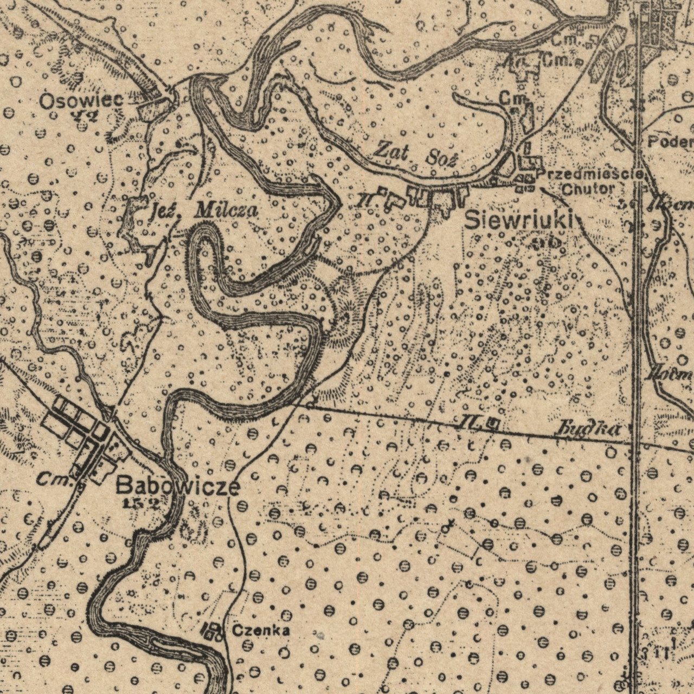

# Гісторыя

Першыя пасяленьні зьявіліся ў гэтых краях яшчэ ў старажытныя часы: з а 1 км на
ўсход ад прафілякторыя «Гомсельмаш», у лесе каля дачнага пасёлка, знаходзіцца
гарадзішча пэрыяду раньняга жалезнага веку V стагодзьдзе да н.э. -- V
стагодзьдзе н.э.

Зь вёсак найстарэйшымі зьяўляюцца Сеўрукі, Чонкі на 2 стагодзьдзі маладзейшыя.
Паляна наймаладзейшая.

## Сеўрукі

Паводле пісьмовых крыніц вядомыя з XVI стагодзьдзя як вёска ў Рэчыцкім павеце
Менскага ваяводзтва Вялікага княства Літоўскага. У 1560 годзе значыцца як хутар
у Гомельскім старостве. У інвэнтары Гомельскага староства 1640-х гадоў
пазначаныя як сяло ва ўладаньні гомельскага баярына Л. Шарынды.

Пасьля 1-га падзелу Рэчы Паспалітай (1772) у складзе Расейскай імпэрыі. У 1777
годзе ў Гомельскай воласьці Беліцкага павета, ва ўладаньні дваран Усьціновічаў
і Клічаўскіх. У 1785 годзе вёска Сеўрукі са 140 душамі мужчынскага полу
куплена казной у яе ўладальнікаў (пані Усьціновічавай і памешчыкаў Клічаўскіх)
для павелічэньня насельніцтва павятовага горада Новай Беліцы. Прыгонныя сяляне
Сеўрукоў станавіліся свабоднымі, запісваліся ў мяшчанскае саслоўе й
перасяляліся большай часткай у павятовы цэнтар.

Дзейнічала прыстань.

Хутар Сеўрукоўскі на карце 1838 года:
   

Гэты хутар, найхутчэй, той самы Хутар, які зьнік у 60-я гг. XX ст., але
застаўся ў памяці і даў назву новаму раёну Гомля, пабудаванаму побач.

Зь іншых цікавостак мы бачым рачулку [Падзярача](locations.html).

### Насельніцтва
- 1777 -- 125 «рэвіскіх душ»
- 1785 -- 140 «рэвіскіх душ»
- 1896 -- 95 двароў
- 1909 -- 121 двор, 627 жыхароў
- 1926 -- 183 двары, 901 жыхар
- 1959 -- 533 жыхара
- 2004 -- 200 гаспадарак, 509 жыхароў
- 2009 -- 529 жыхароў

## Чонкі

Паводле пісьмовых крыніц вёска вядомая з XVII стагодзьдзя, калі тут пачалі
сяліцца ўцекачы з Масковіі праз рэлігійны пераслед. Паводле [А.Ф.
Рогалева](books.html) ў 1760 годзе ў данай мясцовасьці ўзьнік стараверскі
Іасафаўскі скіт, які заснаваў Іасаф, выхадзец з Гжацка.

Пасьля першага падзелу Рэчы Паспалітай (1772) у складзе Расейскай імпэрыі. У
1775 годзе на землях шляхціцаў Клічаўскіх і Усьціновічаў заснаваны стараверскі
Ўсьпенскі мужчынскі манастыр, які ў 1822 годзе перайшоў да Расейскай
праваслаўнай царквы. У 1877 годзе збудаваная драўляная царква, працавала
цагляная вытворчасьць. У 1907 годзе адкрылася народнае вучылішча. 

Сайт [radzima.org](https://www.radzima.org/be/miejsce/chonki.html) публікуе
такое фота царквы пачатку XX ст.:

Але яно падпісанае як «царква Чонска-Макарыеўскага манастыра», магчыма назва
Ўсьпенскага манастыра была пазьней памяняная.

Варта пазначыць, што напачатку вёска знаходзілася далей на поўдзень, там дзе
цяпер знаходзяцца лецішчы, і мела назву «Чонка» (цяпер тое месца вядомае як
«Старая Чонка»). Сярод старых людзей форма «Чонка» захоўвалася доўгі час пасьля
пераносу вёскі на сучаснае месца (да к. XX ст.). Як бачна з карты,
апублікаванай ніжэй, у 1922 Чонка была яшчэ на старым месцы, значыць перанос на
новае месца адбыўся недзе пасьля гэтага часу, але да 1941 г., бо на пачатку 2-й
сусьв. вайны ужо былі дамы на сёньняшніх вуліцах Кастрычніцкай і Піянэрскай.

Чонкі, Сеўрукі й ваколіцы на карце 1922 года:

Як бачна, у тыя часы Сеўрукі былі, збольшага, у раёне сёньняшняй вуліцы
Берагавой, а Чонкі знаходзяцца далёка на поўдзень.

Зь іншых цікавостак мы бачым, што няма ані [Валакі](locations.html), ані
[Вузькай](locations.html), а таксама, што мясцовасьць на поўнач ад сучаснай школы
№1 насіла назву «Падзярачка» (трапіла толькі *Pode*).

### Насельніцтва

- 1926 -- 63 двары
- 2004 -- 946 двароў, 2611 жыхароў
- 2009 -- 2648 жыхароў
- 2014 -- 4500 жыхароў

## Паляна

Заснаваная ў пачатку 1920-х гадоў перасяленцамі з суседніх вёсак на былых
памешчыцкіх землях.

### Насельніцтва
- 1940 -- 124 жыхары, 29 двароў
- 1959 -- 144 жыхара
- 2004 -- 198 жыхароў, 91 гаспадарка
- 2009 -- 220 жыхароў

## Крыніцы

- Карты 1838 і 1922 гадоў узятыя з тэлеграм-каналу [Пошукі старога Гомеля](https://t.me/stary_homel).
- Фота манастыра ўзята з сайта [radzima.org](https://www.radzima.org/be/).
- Гістарычныя зьвесткі з [Wikipedia](https://wikipedia.org).
