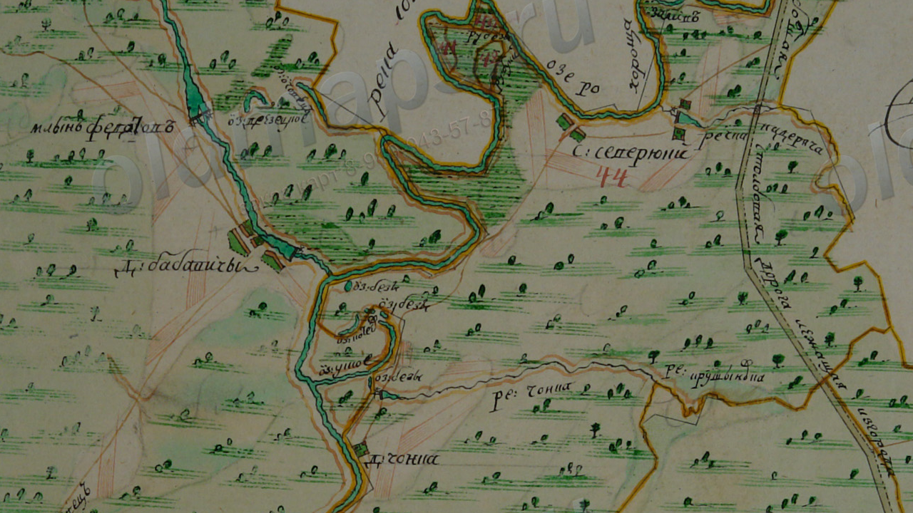

# Гісторыя

Першыя пасяленьні зьявіліся ў гэтых краях яшчэ ў старажытныя часы: з а 1 км на
ўсход ад прафілякторыя «Гомсельмаш», у лесе каля дачнага пасёлка, знаходзіцца
гарадзішча пэрыяду раньняга жалезнага веку V стагодзьдзе да н.э. -- V
стагодзьдзе н.э.

Зь вёсак найстарэйшымі зьяўляюцца Сеўрукі, Чонкі на 2 стагодзьдзі маладзейшыя.
Паляна наймаладзейшая.

## Сеўрукі

Паводле пісьмовых крыніц вядомыя з XVI стагодзьдзя як вёска ў Рэчыцкім павеце
Менскага ваяводзтва Вялікага княства Літоўскага. У 1560 годзе значыцца як хутар
у Гомельскім старостве. У інвэнтары Гомельскага староства 1640-х гадоў
пазначаныя як сяло ва ўладаньні гомельскага баярына Л. Шарынды.

Пасьля 1-га падзелу Рэчы Паспалітай (1772) у складзе Расейскай імпэрыі. У 1777
годзе ў Гомельскай воласьці Беліцкага павета, ва ўладаньні дваран Усьціновічаў
і Клічаўскіх. У 1785 годзе вёска Сеўрукі са 140 душамі мужчынскага полу
куплена казной у яе ўладальнікаў (пані Усьціновічавай і памешчыкаў Клічаўскіх)
для павелічэньня насельніцтва павятовага горада Новай Беліцы. Прыгонныя сяляне
Сеўрукоў станавіліся свабоднымі, запісваліся ў мяшчанскае саслоўе й
перасяляліся большай часткай у павятовы цэнтар.

Дзейнічала прыстань.

Хутар Сеўрукоўскі на карце 1838 года:

Гэты хутар, найхутчэй, той самы Хутар, які зьнік у 60-я гг. XX ст., але
застаўся ў памяці і даў назву новаму раёну Гомля, пабудаванаму побач.

Зь іншых цікавостак мы бачым рачулку [Падзярача](locations.html), а таксама што
ў тыя часы старое рэчышча Сожа называлася Харошчай.

### Насельніцтва
- 1777 -- 125 «рэвіскіх душ»
- 1785 -- 140 «рэвіскіх душ»
- 1896 -- 95 двароў
- 1909 -- 121 двор, 627 жыхароў
- 1926 -- 183 двары, 901 жыхар
- 1959 -- 533 жыхара
- 2004 -- 200 гаспадарак, 509 жыхароў
- 2009 -- 529 жыхароў

## Чонкі

Паводле пісьмовых крыніц вёска вядомая з XVII стагодзьдзя, калі тут пачалі
сяліцца ўцекачы з Масковіі праз рэлігійны перасьлед. Паводле [А.Ф.
Рогалева](books.html) ў 1760 годзе ў данай мясцовасьці ўзьнік стараверскі
Іасафаўскі скіт, які заснаваў Іасаф, выхадзец з Гжацка.

Пасьля першага падзелу Рэчы Паспалітай (1772) у складзе Расейскай імпэрыі. У
1775 годзе на землях шляхціцаў Клічаўскіх і Усьціновічаў заснаваны стараверскі
Ўсьпенскі мужчынскі манастыр, які ў 1822 годзе перайшоў да Расейскай
праваслаўнай царквы. У 1877 годзе збудаваная драўляная царква, працавала
цагляная вытворчасьць. У 1907 годзе адкрылася народнае вучылішча. 

Манастыр Сьвятога Макарыя (былы Ўсьпенскі мужчынскі манастыр), фота 1909 года.
Крыніца фота - [Wikimedia Commons](https://commons.wikimedia.org/wiki/File:Homiel,_%C4%8Conki._%D0%93%D0%BE%D0%BC%D0%B5%D0%BB%D1%8C,_%D0%A7%D0%BE%D0%BD%D0%BA%D1%96_%281909%29.jpg).

Манастыр знаходзіўся на тэрыторыі сучаснага дзіцячага ляґера «Сяльмашавец»,
прыблізна [тут](https://www.openstreetmap.org/search?query=52.33856046402421%2C%2030.94945415453253#map=18/52.33867/30.95036).

Варта пазначыць, што напачатку вёска знаходзілася далей на поўдзень, там дзе
цяпер знаходзяцца лецішчы, і мела назву «Чонка» (цяпер тое месца вядомае як
«Старая Чонка»). Сярод старых людзей форма «Чонка» захоўвалася доўгі час пасьля
пераносу вёскі на сучаснае месца (да к. XX ст.).

Чонкі й Сеўрукі на карце «Плянаў Генэральнага Межаваньня».

 На карце не пазначаны год, але, праз адсутнасьць Новай Беліцы, можна
меркаваць, што яна была складзеная між 1772 і 1777. Калі улічыць, што манастыр
адсутнічае таксама, то зьверху час складаньня карты абмежаваны 1775 годам.
Карты ПГМ былі ня вельмі дакладныя, на іх адсутнічала кааржынатная сетка, але ж
яны мелі шмат дэталяў. Можна бачыць, што [Вузька](locations.html) ўжо існавала,
а вось [Валака](locations.html) -- яшчэ не. Адно з азёр у
[Раздорах](locations.html) мела назву, але разабраць я яе не магу. Алк самая
каштоўная знаходка -- на поўнач ад Чонкі знаходзіцца рачулка Чонка! Найхутчэй,
сёньня гэта [безназоўная рачулка ў
лесе](https://www.openstreetmap.org/#map=16/52.3323/30.9890). Такім чынам,
паходжаньне назвы вёскі можна лічыць разгаданым, засталося высьветліць назву
ракі.

### Насельніцтва

- 1926 -- 63 двары
- 2004 -- 946 двароў, 2611 жыхароў
- 2009 -- 2648 жыхароў
- 2014 -- 4500 жыхароў

## Паляна

Заснаваная ў пачатку 1920-х гадоў перасяленцамі з суседніх вёсак на былых
памешчыцкіх землях.

### Насельніцтва
- 1940 -- 124 жыхары, 29 двароў
- 1959 -- 144 жыхара
- 2004 -- 198 жыхароў, 91 гаспадарка
- 2009 -- 220 жыхароў

## Крыніцы

- Карта 1838 года узятая з тэлеграм-каналу [Пошукі старога Гомеля](https://t.me/stary_homel).
- Гістарычныя зьвесткі з [Wikipedia](https://wikipedia.org).
