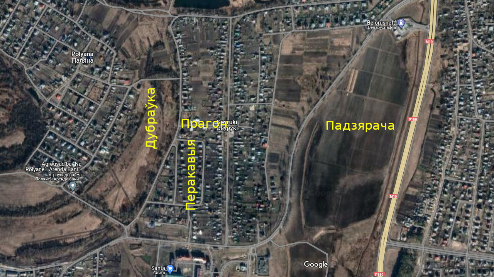
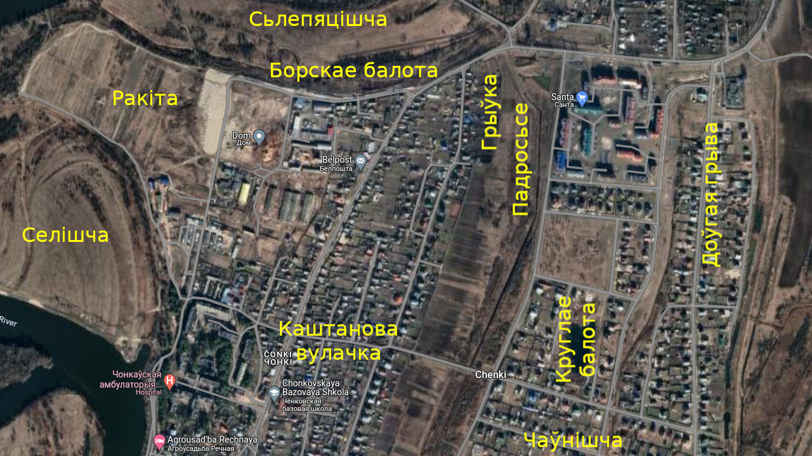
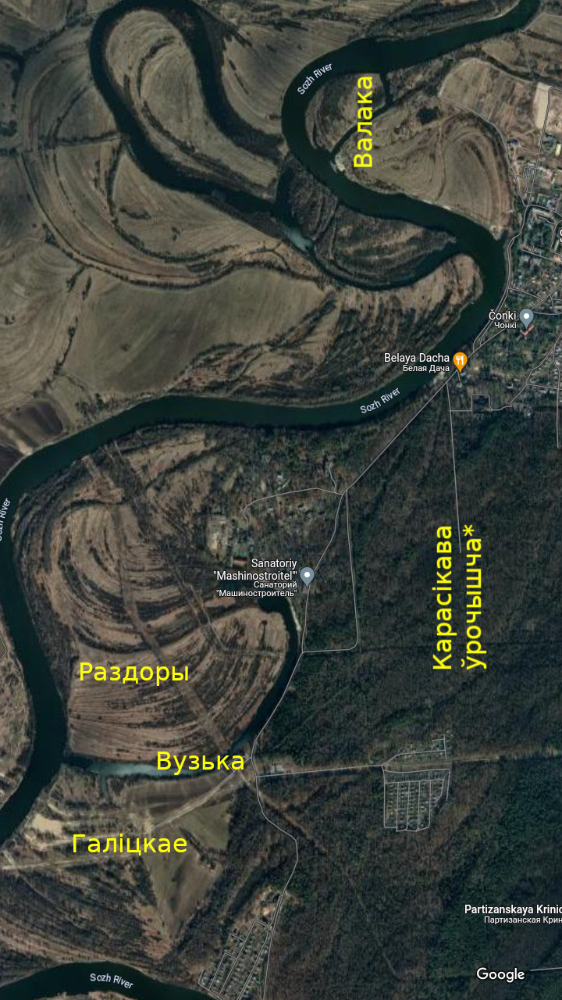

# Мясьціны

Некалі я дадаваў усе назвы, якія даведаўся ў сваёй бабулі, на wikimapia.org ды maps.google.com. Але спачатку google закрылі праект калектыўнай працы з мапамі, а потым нейкія вандалы павыдалялі амаль усё, што я дадаў, і засталіся толькі «Круглае балота», «Восаў» ды «Доўгая грыва». Добра, што на wikimapia.org можна паглядзець выдаленыя аб’екты, гэтак я здолеў аднавіць усе назвы, бо спачатная папяровая вэрсія ды здымак экрана былі страчаныя.

## Месцы й тлумачэньні

## Чонкі й Сеўрукі

- Падзяра́ча -- поле, абмежаванае гомельскай аб’язной дарогай і дарогай на Чонкі. Назва паходзіць ад аднайменнай рэчкі, якая ў часы савецкай мэліярацыі была спрамленая й цяперака выглядае як канава, якая перасякае дарогу на Чонкі каля прыпынку «Хутар».
- Восаў -- могілкі на поўдзень ад Падзярачы. Магчыма раней там таксама існавала паселішча.
- Доўгая гры́ва -- луг на поўдзень ад Сеўрукоў, на ўсход ад былога калгаснага сада. У паўночнай частцы сёньня знаходзіцца каналізацыйная станцыя. На лузе маецца выцягнутае ўзвышша, якое звычайна называецца «грывай».
- Перакавы́я -- колішняе поле на захад ад Сеўрукоў, там дзе цяперака вуліцы з арыгінальнымі назвамі 1, 2 й 3-я Палявыя. Як казала бабуля: «бо там рады́ былі ўзараныя ўпоперак».
- Прагон -- Савецкі завулак.
- Ду́браўка -- луг між Палянай і Сеўрукамі ў раёне Прагона, з поўначы абмежаваны дарогай. Паводле А.Ф. Рогалева словам «дубраўка» на Палесьсі называюць ня толькі лес, але й луг ці балота з драбналесьсем.
- Кра́сная лаза́ -- луг між Палянай і Сожам, на жаль, дакладнага месца на даны момант невядома. Названы так, бо там шмат лазы з чырвонай карой.

- Кру́глае балота -- на поўдзень ад былога калгаснага сада, сёньня тут былы кар’ер.
- Чаўні́шча -- поле (ці луг) на поўдзень ад Круглага балота.
- Падросьсе -- луг, абмежаваны з усходу канавай, што праходзіць на захад ад былога калгаснага сада, з захаду -- невялікім полем (цяпер там агароды) на ўсход ад вул. Піянэрскай, з поўначы -- аўтадарогай. У заходняй частцы падзабалочаная лагчына, якую так і называлі -- Лагчына.
- Борскае балота -- колішняе балота на поўнач ад Чонак, адразу за аўтадарогай, там дзе цяпер канава.
- Сьлепяці́шча -- луг між Борскім балотам, Палянай і Сожам.
- Ракі́та -- колішняе поле на захад ад калгасу. Цяпер тут будуюць каменнае гета «Чонкі-2». Названае так, бо там было шмат кустоў ракіты.
- Се́лішча -- луг між Валакой (гл. ніжэй), Ракітай і вёскай. Некалі там быў пагорак, вядомы як «Се́лікава гара», зьнішчаны ў савецкі час. Хто такі «Се́лік» зьвестак не засталося.
- Каштанова або Гера́сімава вулачка -- кавалак сучаснай вуліцы Камсамольскай між Кастрычніцкай і Сонечнай. Назва паходзіць ад прозьвішчаў ці мянушак колішніх жыхароў: Каштановых ці Герасімавых, адпаведна.

- Валака́ -- старое рэчышча Сожа на захад ад Ракіты. Паводле А.Ф. Рогалева слова «валака» азначае «забалочанае месца».
- Ву́зька -- старое рэчышча Сожа, сёньня вядомае як воз. Вузкае або «Старык».
- Раздоры -- луг за Вузькай (на правым беразе).
- Га́ліцкае -- луг на поўдзень ад Вузькі (на левым беразе).
- Кара́сікава ўрочышча -- дакладнага месца ўжо ня памятаю. Недзе ў лесе на дарозе ў Галіцкае.
- Восіпава ўрочышча -- ўвогуле нічога не вядома, як быццам бы названае ў гонар лесьніка.

## Назвы, узятыя зь літаратуры

Прыведзеныя ніжэй назвы ўзятыя з кнігі А.Ф. Рогалева «Топонимический словарь Гомеля и Гомельского района» (Гомель, 2012). Паводле ягоных словаў, яны былі запісаныя ў 80-х -- 90-х гг. XX ст. студэнтамі філфаку ГДУ у час летняй практыкі. На жаль, іх зусім мала, кніга напісаная па-расейску, назвы ня маюць націскаў, і, што найгорш, для паловы зь іх адсутнічае дакладная геаграфічная прывязка.

- *Завузак* або *Узкое* -- гл. Ву́зька.
- *Челнище* -- у кнізе сказана, што гэта балота ў ваколіцах Чонак. Тут яўная блытаніна, бо балота называлася «Круглым», а Чаўнішча -- тэрыторыя на поўдзень ад яго.
- *Долгая грива* -- апісаньне без дакладнай прывязкі (луг ля Сеўрукоў, пасярэдзіне -- выцягнутае ўзвышша), але, відавочна, што гаворка пра Доўгую грыву, пра якую напісана вышэй.
- *Дубровка* -- выган і дарога ля выгану. На жаль, у кнізе памылка: сказана, што дарога зьвязвала ў мінулым Сеўрукі з Хутарам. Альбо гэта не памылка, і ля Сеўрукоў па розныя бакі ад вёскі было дзьве мясьціны з адной назвай, што ня надта праўдападобна. Таму я думаю, што насамрэч, гэта Ду́браўка, што між Палянай і Сеўрукамі.
- *Ближний Бук* і *Дальний Бук* -- ручаі, левыя прытокі Сожа ў раёне Чонак. Дакладная геаграфічная прывязка адсутнічае. А.Ф. Рогалеў лічыць, што назва паходзіць ад наяўнага ў некаторых славянскіх і балцкіх мовах слова «буга», якое азначае «сырое, багністае месца» або «берагавы лес ці кустоўе, якія залівае паводка».
- *Бреусова круча* -- высокі бераг Сожа ля Чонак, назва паходзіць ад прозьвішча вяскоўца Брэвуса. Праблема ў тым, што Брэвусы сеўрукоўцы, таму, найхутчэй, тут памылка ў запісах, і гэтую назву мела стромае месца ў Сеўруках, ля вуліцы Берагавой, дзе Брэвусы й жылі.
- *Волковня́* (Валкаўня́) -- луг у ваколіцах Сеўрукоў. Назва выводзіцца ад слова «волкі», якое мае значэньне «вільготны», «сыры» (ад якога таксама паходзіць «Валака»). Ізноў праблемы з удакладненьнем. Варыянты знаходжаньня -- на захад ад Паляны (гл. Кра́сная лаза́), бліжэй да Сожа, на поўнач ад Сеўрукоў між старым і сучасным рэчышчамі Сожа (найбольш імаверны варыянт, бо там шмат забалочаных мясьцін). Месца націску й вымаўленьне былі высьветленыя ў прыватным ліставаньні са сп. Рогалевым.

## Ваколіцы

- Сасоньнік -- у Новай Беліцы ў раёне скрыжаваньня вуліц Зайцава й Будзённага. Тут яшчэ хапае соснаў, што падказвае адкуль пайшла назва.
- Пяскі́ -- у Новай Беліцы ў раёне скрыжаваньня вуліц Будзённага й Севастопальскай. Тут раней была аднайменная вёска, якая недзе пасьля вайны была ўключаная ў склад горада.
- Смаля́рка -- у Новай Беліцы ў раёне скрыжаваньня вуліц Тэхнічнай і 1-й Тэхнічнай, прадпрыемства «Лесахімучастак», там займаліся загатоўкай сасновай смалы.
