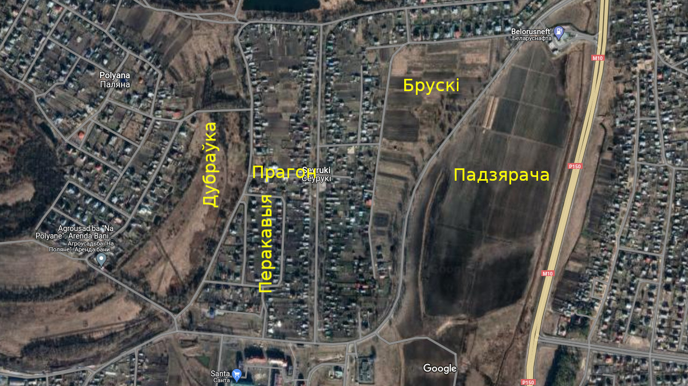

# Мясьціны

Некалі я дадаваў усе назвы, якія даведаўся ў сваёй бабулі, на wikimapia.org ды maps.google.com. Але спачатку google закрылі праект калектыўнай працы з мапамі, а потым нейкія вандалы павыдалялі амаль усё, што я дадаў, і засталіся толькі «Круглае балота», «Восаў» ды «Доўгая грыва». Добра, што на wikimapia.org можна паглядзець выдаленыя аб’екты, гэтак я здолеў аднавіць усе назвы, бо спачатная папяровая вэрсія ды здымак экрана былі страчаныя.

## Месцы й тлумачэньні

## Чонкі й Сеўрукі

- Падзяра́ча -- поле, абмежаванае гомельскай аб’язной дарогай і дарогай на Чонкі. Назва паходзіць ад аднайменнай рэчкі, якая ў часы савецкай мэліярацыі была спрамленая й цяперака выглядае як канава, якая перасякае дарогу на Чонкі каля прыпынку «Хутар».
- Восаў -- могілкі на поўдзень ад Падзярачы.
- Доўгая гры́ва -- поле на поўдзень ад Сеўрукоў, на захад ад былога калгаснага сада. У паўночнай частцы сёньня знаходзіцца каналізацыйная станцыя.
- Перакавы́я -- колішняе поле на захад ад Сеўрукоў, там дзе цяперака вуліцы з арыгінальнымі назвамі 1, 2 й 3-я Палявыя. Як казала бабуля: «бо там рады́ былі ўзараныя ўпоперак».
- Прагон -- Савецкі завулак.
- Ду́браўка -- луг між Палянай і Сеўрукамі ў раёне Прагона, з поўначы абмежаваны дарогай.

    

- Круглае балота -- на поўдзень ад былога калгаснага сада, сёньня тут былы кар’ер.
- Чаўні́шча -- поле на поўдзень ад Круглага балота.
- Падросьсе -- луг абмежаваны з усходу канавай, што праходзіць на ўсход ад былога калгаснага сада, з захаду -- невялікім полем (цяпер там агароды) на захад ад вул. Піянэрскай, з поўначы -- аўтадарогай. У заходняй частцы падзабалочаная лагчына, якую так і называлі -- Лагчына.
- Борскае балота -- колішняе балота на поўнач ад Чонак, адразу за аўтадарогай, там дзе цяпер канава.
- Сьлепяці́шча -- луг між Борскім балотам, Палянай і Сажом.
- Ракі́та -- колішняе поле на захад ад калгасу. Цяпер тут будуюць каменнае гета «Чонкі-2».
- Се́лішча -- луг між Валакой (гл. ніжэй), Ракітай і вёскай. Некалі там быў пагорак, вядомы як «Се́лікава гара», зьнішчаны ў савецкі час. Хто такі «Се́лік» зьвестак не засталося.
- Каштанова або Гера́сімава вулачка -- кавалак сучаснай вуліцы Камсамольскай між Кастрычніцкай і Сонечнай. Назва паходзіць ад прозьвішчаў ці мянушак колішніх жыхароў: Каштановых ці Герасімавых, адпаведна.

    

- Валака́ -- старое рэчышча Сожа на захад ад Ракіты.
- Ву́зька -- старое рэчышча Сожа, сёньня вядомае як воз. Вузкае або «Старык».
- Раздоры -- луг за Вузькай (на правым беразе).
- Га́ліцкае -- луг на поўдзень ад Вузькі (на левым беразе).
- Кара́сікава ўрочышча -- дакладнага месца ўжо ня памятаю. Недзе ў лесе на дарозе ў Галіцкае.
- Восіпава ўрочышча - ўвогуле нічога не вядома, як быццам названае ў гонар лесьніка.

    

## Ваколіцы

- Сасоньнік -- у Новай Беліцы ў раёне скрыжаваньня вуліц Зайцава й Будзённага. Тут яшчэ хапае соснаў, што падказвае адкуль пайшла назва.
- Пяскі́ -- у Новай Беліцы ў раёне скрыжаваньня вуліц Будзённага й Севастопальскай. Тут раней была аднайменная вёска, якая недзе пасьля вайны была ўключаная ў склад горада.
